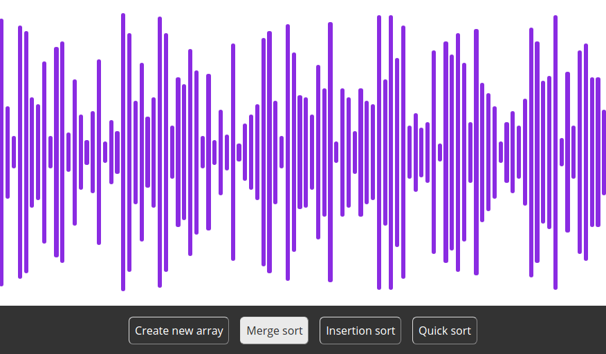

# [react-sort-visualizer](https://lexesjan.github.io/react-sort-visualizer/)

I built this application as I was interested in how the various sorting algorithms we use looked like when visualized. This project also helped me greatly to learn JavaScript, HTML and CSS. [Link to website](https://lexesjan.github.io/react-sort-visualizer/).

  ## Built with
  - JavaScript - The code language used
  - [ReactJS](https://reactjs.org/) - JavaScript library used to build the user interface
 
